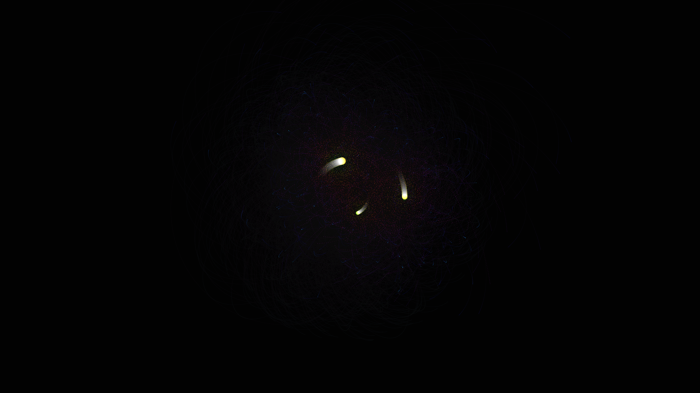

# generative_orbital_gravity_dance_2d

An n-body physics simulation where multiple massive stars pull on a large field of tiny planets. The glowing trails of the planets reveal the complex, chaotic, and beautiful orbital mechanics of gravity, rendered with additive blending to create a cosmic dance of light.

## Technical Details

- **Language**: Python + py5
- **Format**: Animation (15s @ 60fps)
- **Renderer**: 2D

## Output

