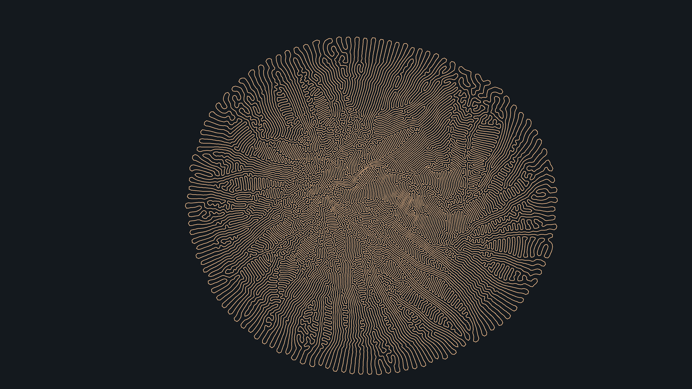

# generative_organic_differential_growth_2d

## Metadata
- **Date**: 2026-07-01
- **Theme**: A generative visualization of Differential Growth, simulating the biological process of a single clo
- **Technique**: Unknown
- **Logic Lab Reference**: 

## Concept
A generative visualization of Differential Growth, simulating the biological process of a single closed loop expanding into complex brain-coral / fingerprint patterns.

## Technical Details
- **Renderer**: Unknown
- **Simulation**: Unknown
- **Visuals**: Unknown
- **Animation**: Contains animation details
