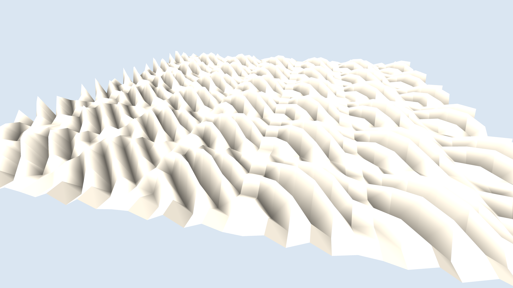

# generative_origami_tessellation_3d

## Metadata
- **Date**: 2026-06-15
- **Theme**: An animated 15s 3D sequence of a flat sheet of virtual paper dynamically folding and unfolding into 
- **Technique**: 3D rendering using `py5.P3D`. The geometry consists of a grid of triangle strips where the Z-depth and folding angles are driven by a combination of alternating sine and cosine waves. The phase shifts continuously over time, making the surface ripple with zig-zag folds. The paper is shaded using `py5.directional_light()` and `py5.ambient_light()` to give it a smooth, realistic paper/plastic appearance.
- **Logic Lab Reference**: 

## Concept
An animated 15s 3D sequence of a flat sheet of virtual paper dynamically folding and unfolding into complex origami-like tessellations.

## Technical Details
- **Renderer**: P3D
- **Simulation**: Unknown
- **Visuals**: Unknown
- **Animation**: Unknown
