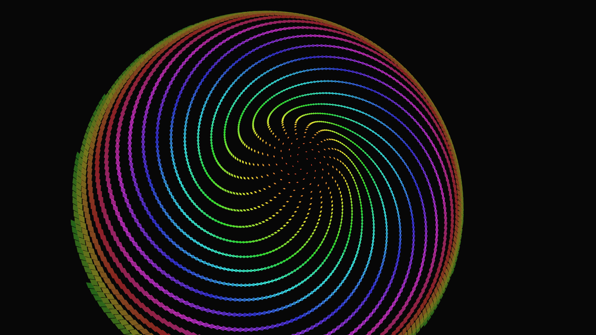

# generative_phyllotaxis_sunflower

## Metadata
- **Date**: 2026-05-23
- **Theme**: A 3D generative simulation exploring the mathematics of Phyllotaxis and the Golden Ratio
- **Technique**: Unknown
- **Logic Lab Reference**: 

## Concept
A 3D generative simulation exploring the mathematics of Phyllotaxis and the Golden Ratio.

- **Date**: 2026-05-23
- **Theme**: Phyllotaxis, golden ratio, Fibonacci sequence, sunflower seeds, organic growth, sacred geometry.
- **Technique**: Positions 3,000 "seeds" using the classic mathematical model of plant growth: $r = c \sqrt{n}$ and $\theta = n \times 137.5^\circ$ (the Golden Angle). To make the simulation kinetic and mesmerizing, the exact angle is continuously modulated by a tiny sine wave offset. This extremely small perturbation breaks the perfect Fibonacci spirals, causing the intersecting visual arcs to warp, twist, and weave into entirely new geometric interference patterns before snapping back to the perfect sunflower formation. The entire structure is rendered as a subtly breathing 3D dome, with each seed rotating and glowing dynamically. 15s 60fps MP4.
- **Description**: A perfect, glowing sunflower made of 3,000 neon diamond petals spins slowly in a dark void. As the underlying mathematical angle shifts by fractions of a degree, the perfect spiral arms of the flower begin to twist and cross over one another. The visual structure ripples and breathes, dissolving into complex diamond grids and multi-armed vortexes before seamlessly reforming its hypnotic, natural Fibonacci perfection. The colors radiate from the center, creating a mesmerizing display of organic geometry.

## Technical Details
- **Renderer**: Unknown
- **Simulation**: Unknown
- **Visuals**: Unknown
- **Animation**: Contains animation details
