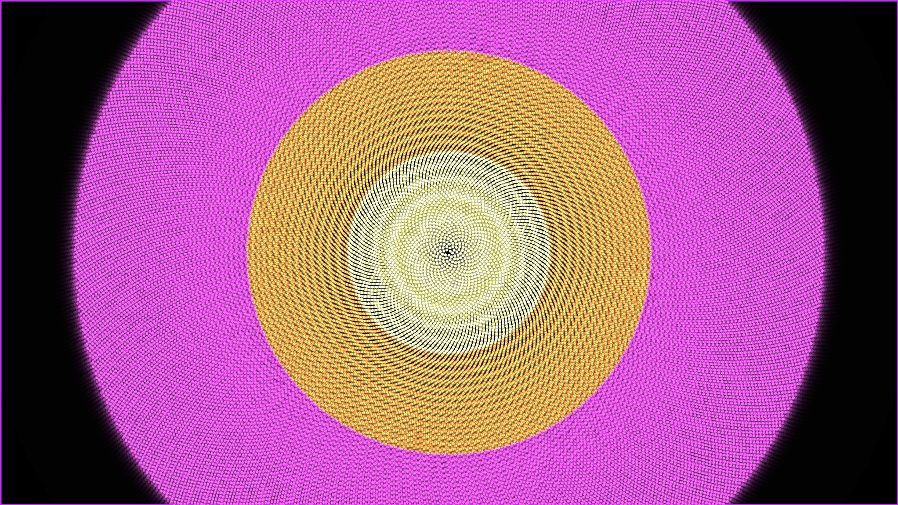

# generative_phyllotaxis_sunflower_spiral_2d

## Metadata
- **Date**: 2026-06-28
- **Theme**: A mesmerizing geometric spiral based on the golden ratio (phyllotaxis)
- **Technique**: Utilizing NumPy vectorization to continuously evaluate `r = c * sqrt(n)` and `theta = n * 137.5 + t` for 40,000 individual "seeds" in real-time. By splitting the results into radial buckets, the seeds are drawn in massive point batches mapped to neon yellow, orange, and magenta to emulate glowing layers against a dark void. Additive blending creates intense glowing trails.
- **Logic Lab Reference**: 

## Concept
A mesmerizing geometric spiral based on the golden ratio (phyllotaxis). It expands outwards and constantly rotates, creating a hypnotic zooming vortex of glowing neon seeds.

## Technical Details
- **Renderer**: Unknown
- **Simulation**: Unknown
- **Visuals**: Unknown
- **Animation**: Contains animation details
