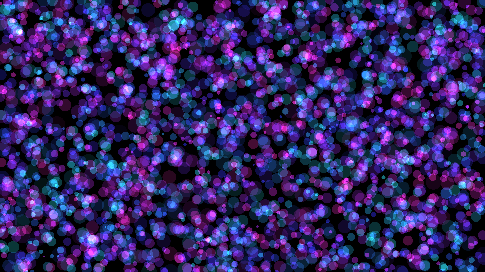

# generative_quantum_foam_bubbles_2d

## Metadata
- **Date**: 2026-06-27
- **Theme**: **Date**: 2026-06-27
- **Technique**: A grid/space populated by thousands of circles. The radii of circles are determined by a fast-shifting 3D noise field, making them expand and contract. Additive blending creates intense hot spots where bubbles overlap.
- **Logic Lab Reference**: 

## Concept
**Date**: 2026-06-27

## Technical Details
- **Renderer**: Unknown
- **Simulation**: Unknown
- **Visuals**: Unknown
- **Animation**: Unknown
