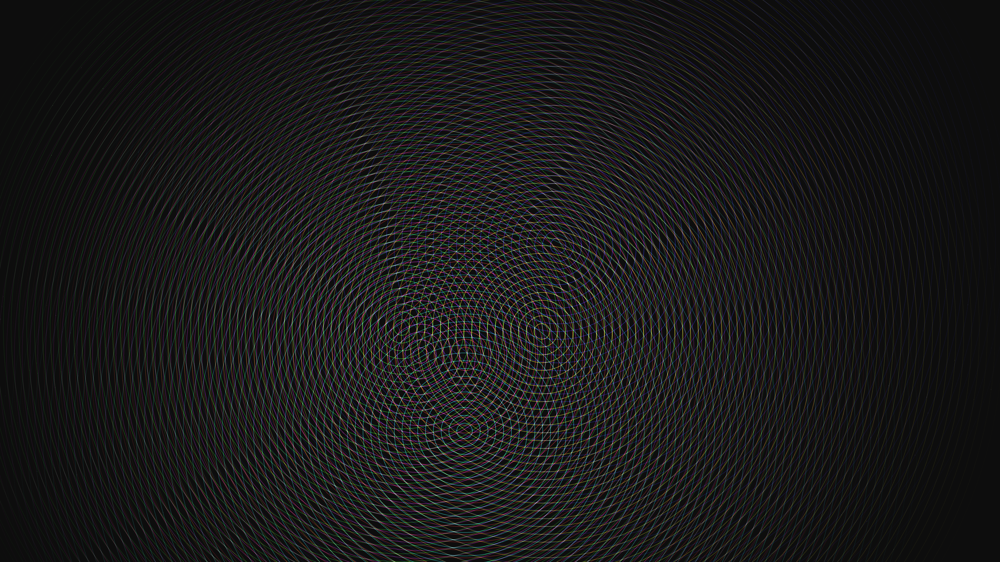

# generative_quantum_interference_pattern_2d

## Metadata
- **Date**: 2026-06-21
- **Theme**: An animated 15s sequence of an intricate, mesmerizing visualization of quantum interference
- **Technique**: Unknown
- **Logic Lab Reference**: 

## Concept
An animated 15s sequence of an intricate, mesmerizing visualization of quantum interference. Concentric ripples emanate from multiple moving points and overlap to create complex moiré patterns and vibrant interference fringes.

- **Theme**: An intricate, mesmerizing visualization of quantum interference. Concentric ripples emanate from multiple moving points and overlap to create complex moiré patterns and vibrant interference fringes.
- **Technique**: Using many concentric circles radiating from moving focal points. As these circles overlap with additive blending, bright interference patterns naturally emerge, simulating a pixel-shader-like effect.

## Technical Details
- **Renderer**: Unknown
- **Simulation**: Unknown
- **Visuals**: Unknown
- **Animation**: Unknown
