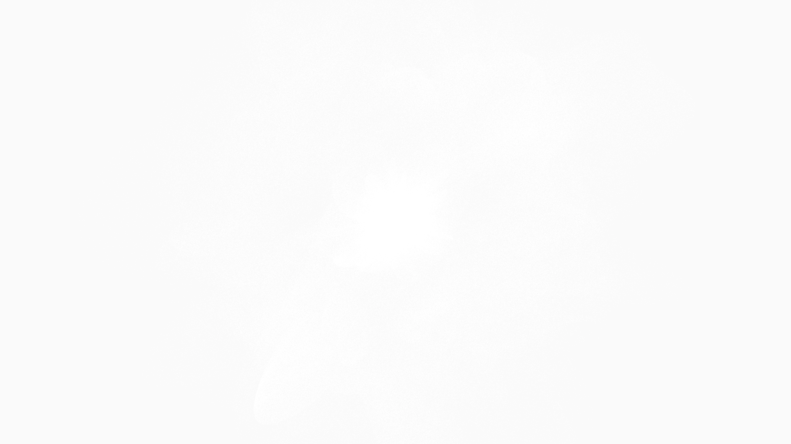

# generative_quantum_superposition_clouds_3d

An animated 15s sequence of a dense, cloudy structure built from millions of tiny overlapping points in 3D space. The points follow probability clouds generated by complex noise functions, simulating quantum superposition states.

- **Theme**: A dense, cloudy structure built from millions of tiny overlapping points in 3D space. The points follow probability clouds generated by complex noise functions, simulating quantum superposition states.
- **Technique**: Generates points using spherical coordinates where the radius is modulated by 3D perlin noise. Using a very low alpha point render, it builds up dense volumetric shapes that look like electron clouds or nebulae.

