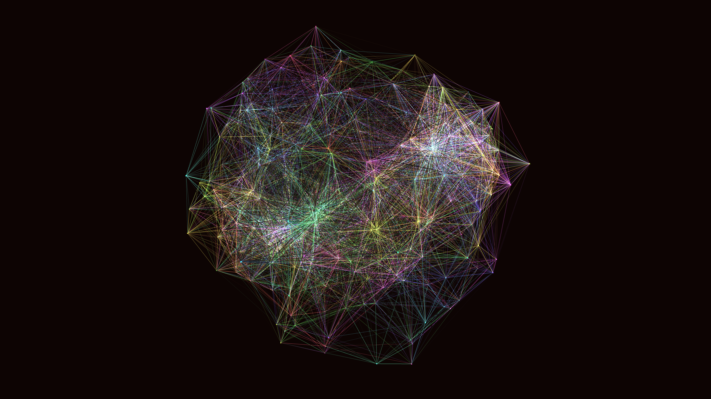

# generative_quantum_superposition_fields_3d

## Metadata
- **Date**: 2026-06-21
- **Theme**: An animated 15s sequence of a generative 3D simulation of quantum superposition fields
- **Technique**: Unknown
- **Logic Lab Reference**: 

## Concept
An animated 15s sequence of a generative 3D simulation of quantum superposition fields. A network of glowing nodes draw connections to their neighbors, jittering in probabilistic states to form a vibrant, interconnected web.

- **Theme**: A visualization of quantum superposition fields where particles exist in multiple probabilistic states simultaneously, rendered as interconnected glowing webs in a 3D space.
- **Technique**: A network of 3D nodes that draw lines to their nearest neighbors if they are within a certain distance, simulating entanglement. The positions of the nodes jitter based on 3D noise to simulate superposition. Additive blending and neon coloring.

## Technical Details
- **Renderer**: Unknown
- **Simulation**: Unknown
- **Visuals**: Unknown
- **Animation**: Unknown
