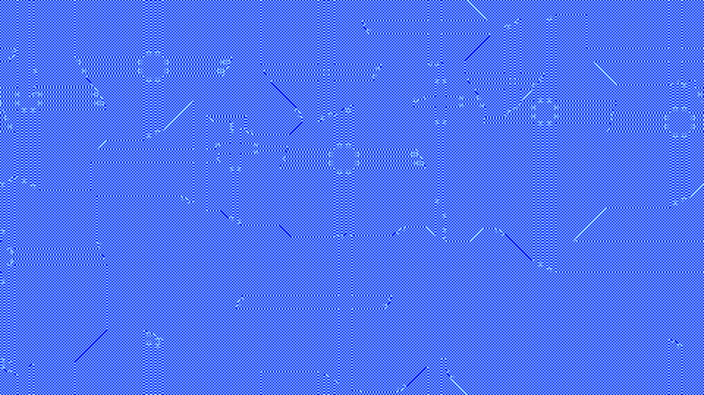

# generative_reaction_diffusion_cellular_2d

An accelerated simulation of the Gray-Scott reaction-diffusion model. Two simulated chemicals interact and diffuse across the canvas, forming complex Turing patterns that resemble biological cell growth, coral, or animal spots. The simulation parameters subtly drift over time, causing the pattern to continuously morph between spots and labyrinthine stripes.

## Technical Details

- **Language**: Python + py5
- **Format**: Animation (15s @ 60fps)
- **Renderer**: 2D

## Output

