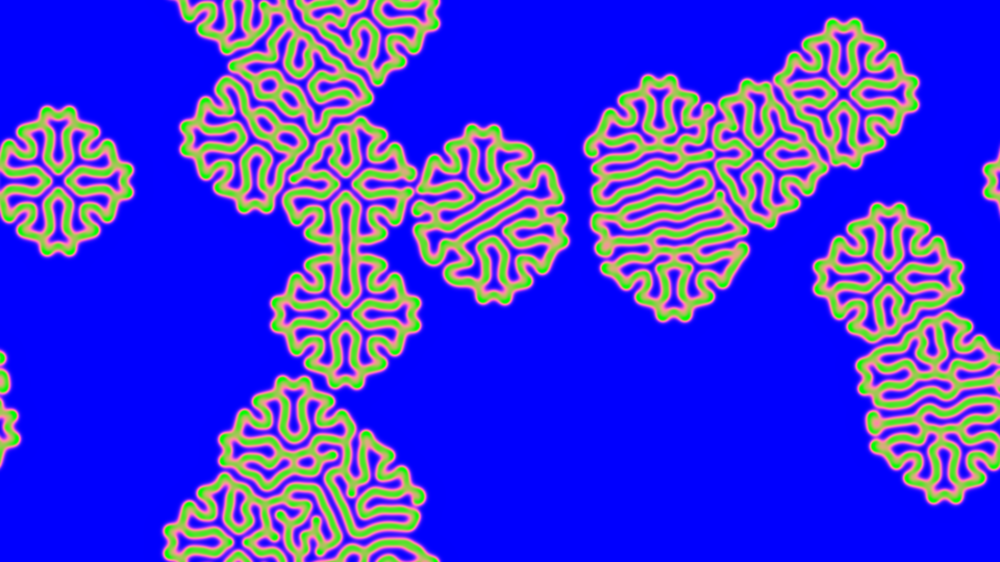

# generative_reaction_diffusion_cellular_growth_2d

## Metadata
- **Date**: 2026-06-25
- **Theme**: - **Theme**: A Gray-Scott reaction-diffusion system simulating organic, cellular growth patterns mim
- **Technique**: Unknown
- **Logic Lab Reference**: 

## Concept
- **Theme**: A Gray-Scott reaction-diffusion system simulating organic, cellular growth patterns mimicking coral or brain tissue.
- **Technique**: 2D Gray-Scott Reaction-Diffusion using NumPy convolution to update concentrations on every frame. The scalar field is then mapped to an iridescent color gradient and rendered via a py5 image buffer.
- **Palette**: Iridescent bioluminescent greens and blues transitioning into deep purples.

## Technical Details
- **Renderer**: Unknown
- **Simulation**: Unknown
- **Visuals**: Unknown
- **Animation**: Unknown
