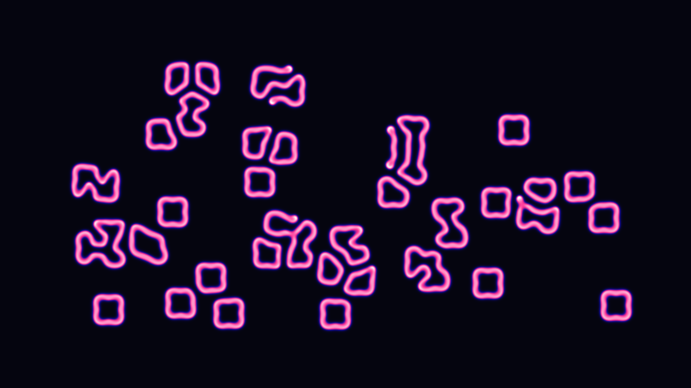

# generative_reaction_diffusion_coral_2d

## Metadata
- **Date**: 2026-06-28
- **Theme**: A vibrant, glowing simulation of the Gray-Scott reaction-diffusion model that organically grows and 
- **Technique**: Evaluating complex array mathematics (Laplacian convolutions and reaction kinetics equations) iteratively over a high-resolution 2D grid. The continuous drifting of the feed (f) and kill (k) rates causes the mathematical "coral" to morph from spots to stripes to dense maze-like structures. Py5's optimized NumPy array mapping is used to instantly draw the simulated grid directly to the screen at a high frame rate.
- **Logic Lab Reference**: 

## Concept
A vibrant, glowing simulation of the Gray-Scott reaction-diffusion model that organically grows and breathes like bioluminescent neon coral on the seafloor.

## Technical Details
- **Renderer**: Unknown
- **Simulation**: Unknown
- **Visuals**: Unknown
- **Animation**: Contains animation details
