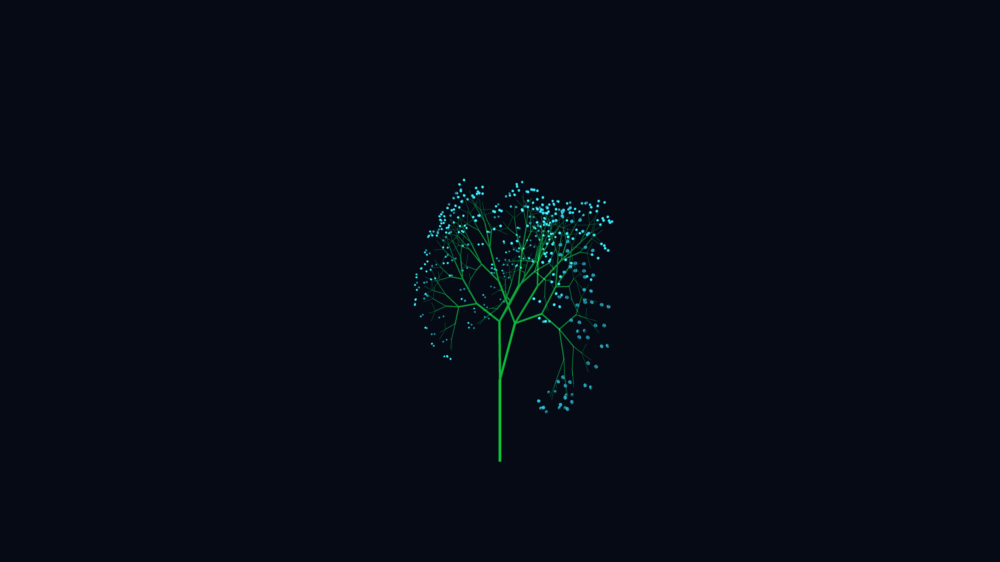

# generative_recursive_bioluminescent_fern_3d

## Metadata
- **Date**: 2026-06-14
- **Theme**: An animated 15s sequence showing an intricate, glowing fractal fern slowly swaying underwater in a d
- **Technique**: A recursive 3D branching algorithm (similar to a parametric L-System). The branches are drawn as thick, tapered cylinders or line segments. The angle of each branch is modulated by a slow-moving 3D OpenSimplex noise field, giving it a natural, organic swaying motion. The tips of the branches are drawn with multiple layers of additive blending to create a glowing effect.
- **Logic Lab Reference**: 

## Concept
An animated 15s sequence showing an intricate, glowing fractal fern slowly swaying underwater in a deep abyss.

## Technical Details
- **Renderer**: Unknown
- **Simulation**: Unknown
- **Visuals**: Unknown
- **Animation**: Unknown
