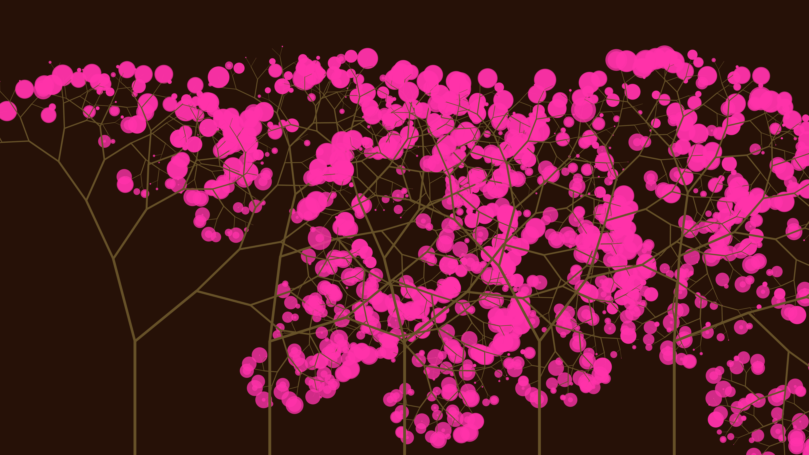

# generative_recursive_tree_canopy_2d

## Metadata
- **Date**: 2026-06-27
- **Theme**: Generative Art
- **Technique**: Uses a recursive fractal branching algorithm to generate tree structures. The angle of each branch varies dynamically using continuous OpenSimplex noise and trigonometric functions, simulating organic growth and environmental wind forces. Colored glowing circles represent leaves blooming at the tips of the branches.
- **Logic Lab Reference**: 

## Concept
No concept description provided.

## Technical Details
- **Renderer**: Unknown
- **Simulation**: Unknown
- **Visuals**: Unknown
- **Animation**: Unknown
