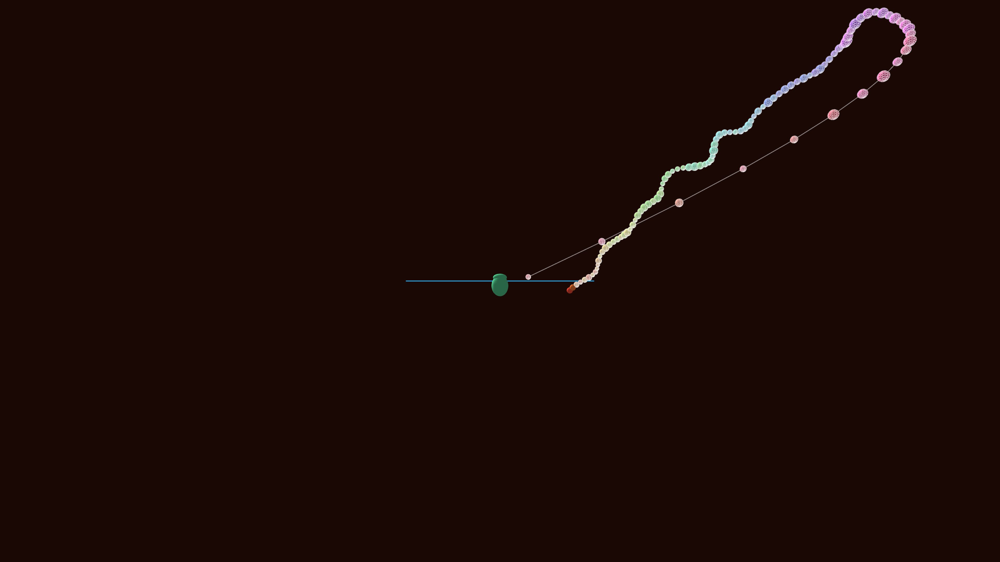

# generative_ribosomal_translation_pulse_3d

## Metadata
- **Date**: 2026-06-20
- **Theme**: Visualizing the process of protein synthesis, where mRNA is translated by ribosomes into a polypepti
- **Technique**: A 3D simulation showing a large organic structure (ribosome, composed of a large and small subunit) moving along a central spine (mRNA strand). As it moves, it continuously emits a growing chain of colorful spheres representing amino acids. The newly formed polypeptide chain dynamically folds into a complex secondary/tertiary structure using a noise-driven random walk that affects older segments of the chain more heavily than the newly ejected ones. Rendered with directional lighting.
- **Logic Lab Reference**: 

## Concept
Visualizing the process of protein synthesis, where mRNA is translated by ribosomes into a polypeptide chain (inspired by GO:0006412 - translation).

## Technical Details
- **Renderer**: Unknown
- **Simulation**: Unknown
- **Visuals**: Unknown
- **Animation**: Contains animation details
