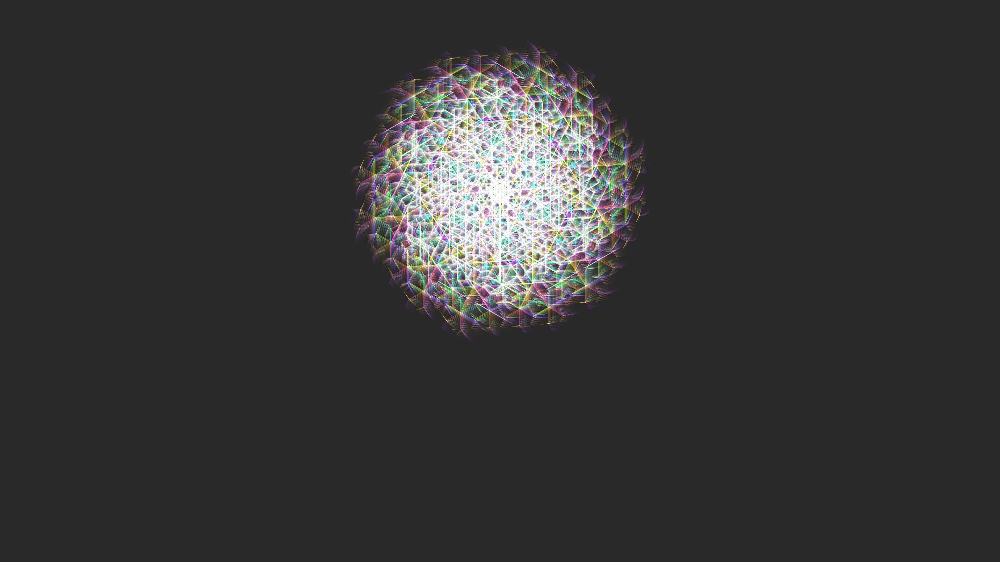

# generative_sacred_geometry_fractal_bloom_2d

## Metadata
- **Date**: 2026-06-26
- **Theme**: An animated 15-30s sequence of a pulsing, recursive fractal bloom based on sacred geometry
- **Technique**: Unknown
- **Logic Lab Reference**: 

## Concept
An animated 15-30s sequence of a pulsing, recursive fractal bloom based on sacred geometry.

- **Theme**: A neon-colored, geometric fractal bloom that pulses and grows recursively, reminiscent of sacred geometry and mystical mandalas.
- **Technique**: Recursive tree-branching algorithm drawing lines outward in a radial pattern. The length of the branches pulses using a sine wave, and the entire structure is rendered with additive blending and motion blur.

## Technical Details
- **Renderer**: Unknown
- **Simulation**: Unknown
- **Visuals**: Unknown
- **Animation**: Unknown
