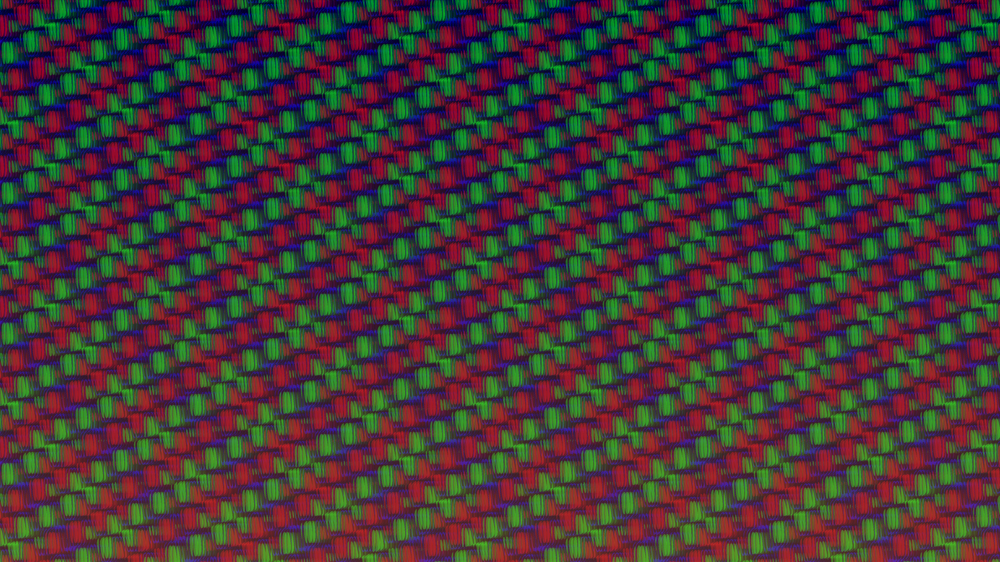

# generative_slit_scan_glitch_landscape_2d

## Metadata
- **Date**: 2026-06-28
- **Theme**: An intense, colorful moving landscape generated using digital slit-scan techniques, evoking a feelin
- **Technique**: A full 4K buffer is maintained directly in a NumPy array. Each frame, the array is shifted to the left by 20 pixels, and a new 20-pixel column of glitchy, mathematically generated "noise" (created from interfering sine and cosine fields) is injected on the right edge. Scanlines and thresholding are applied to make it look like a corrupted retro screen. The numpy array is instantly drawn to the py5 canvas using `py5.create_image_from_numpy`.
- **Logic Lab Reference**: 

## Concept
An intense, colorful moving landscape generated using digital slit-scan techniques, evoking a feeling of driving through a neon, glitched 80s cyberpunk city at hyper-speed.

## Technical Details
- **Renderer**: Unknown
- **Simulation**: Unknown
- **Visuals**: Unknown
- **Animation**: Contains animation details
