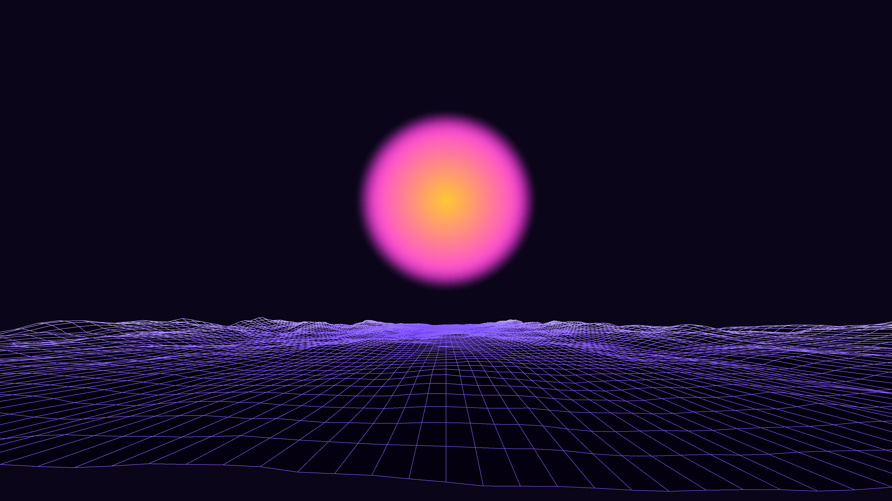

# generative_synthwave_terrain_flight_2d

## Metadata
- **Date**: 2026-06-28
- **Theme**: An endless, forward-moving 3D wireframe grid representing a retro 1980s synthwave landscape
- **Technique**: Because this animation is rendered strictly in 2D (without py5's `P3D` engine), a 3D perspective projection algorithm is manually programmed ($X = x / z \times fov$, $Y = y / z \times fov$). The endless mountains are generated using 2D Perlin noise and are drawn row by row. To simulate occlusion (so mountains in front hide the mountains behind them) without using a traditional 3D depth buffer, the horizontal `QUAD_STRIP` rows are rendered from the furthest $z$ distance to the closest $z$ distance—a classic use case of the Painter's Algorithm!
- **Logic Lab Reference**: 

## Concept
An endless, forward-moving 3D wireframe grid representing a retro 1980s synthwave landscape. As the camera flies forward, giant procedurally generated mountains rise and fall below, leading toward an enormous glowing sunset on the horizon.

## Technical Details
- **Renderer**: P3D
- **Simulation**: Unknown
- **Visuals**: Unknown
- **Animation**: Contains animation details
