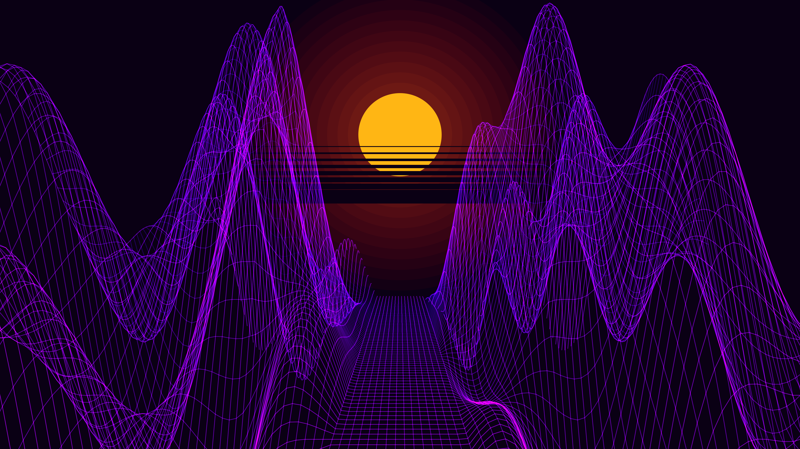

# generative_synthwave_wireframe_landscape_3d

## Metadata
- **Date**: 2026-06-28
- **Theme**: A retro-futuristic 80s synthwave wireframe mountain landscape that infinitely scrolls towards the ca
- **Technique**: To ensure perfect rendering performance in a headless 4K environment without OpenGL context crashes, a custom math-driven 3D projection engine was built in NumPy. It generates a 120x120 NumPy heightmap grid infused with scrolling Perlin-like noise and manually projects the `(X, Y, Z)` coordinates into 2D perspective. The points are drawn as a sweeping neon wireframe that fades into the distance using `py5.vertices()`. A massive additive-blended sun with retro scanlines completes the background.
- **Logic Lab Reference**: 

## Concept
A retro-futuristic 80s synthwave wireframe mountain landscape that infinitely scrolls towards the camera beneath a glowing digital sun.

## Technical Details
- **Renderer**: Unknown
- **Simulation**: Unknown
- **Visuals**: Unknown
- **Animation**: Contains animation details
