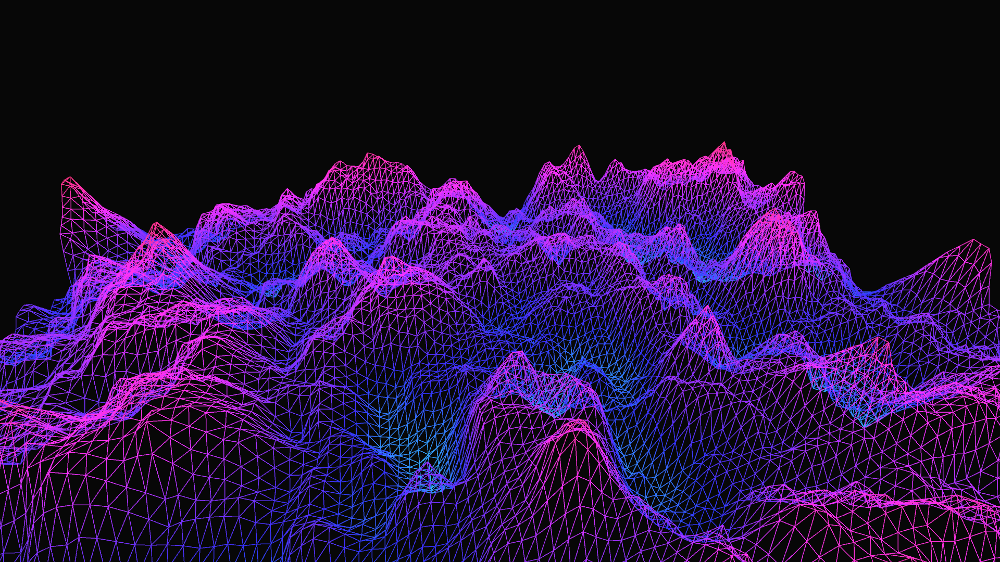

# generative_terrain_topography

## Metadata
- **Date**: 2026-05-23
- **Theme**: A procedurally generated, infinite wireframe landscape representing a glowing topographic map
- **Technique**: Unknown
- **Logic Lab Reference**: 

## Concept
A procedurally generated, infinite wireframe landscape representing a glowing topographic map.

- **Date**: 2026-05-23
- **Theme**: Generative terrain, Perlin noise, topography, retro-futurism (Synthwave aesthetic).
- **Technique**: Evaluates 2D Perlin noise across a 120x90 grid to compute elevation data. Instead of generating a solid mesh with lighting, the terrain is drawn as a wireframe using `py5.TRIANGLE_STRIP` without `py5.fill`. The Y-axis of the noise sampling space is offset by time `t`, creating an infinite scrolling effect that simulates the camera flying forward at high speed over the landscape. The stroke color of each vertex is dynamically mapped to its Z-elevation, transitioning from deep cool blues in the valleys to bright, hot pinks and reds at the mountain peaks. 15s 60fps MP4.
- **Description**: The camera glides swiftly over a vast, undulating wireframe mountain range. The landscape is entirely composed of brightly glowing neon lines against a pitch-black void, reminiscent of 80s synthwave aesthetics and classic vector graphics. Deep valleys flow underneath the camera in cool cyan, while jagged peaks rise up in brilliant magenta and orange, shifting seamlessly as the terrain endlessly generates ahead of the viewer.

## Technical Details
- **Renderer**: Unknown
- **Simulation**: Unknown
- **Visuals**: Unknown
- **Animation**: Contains animation details
