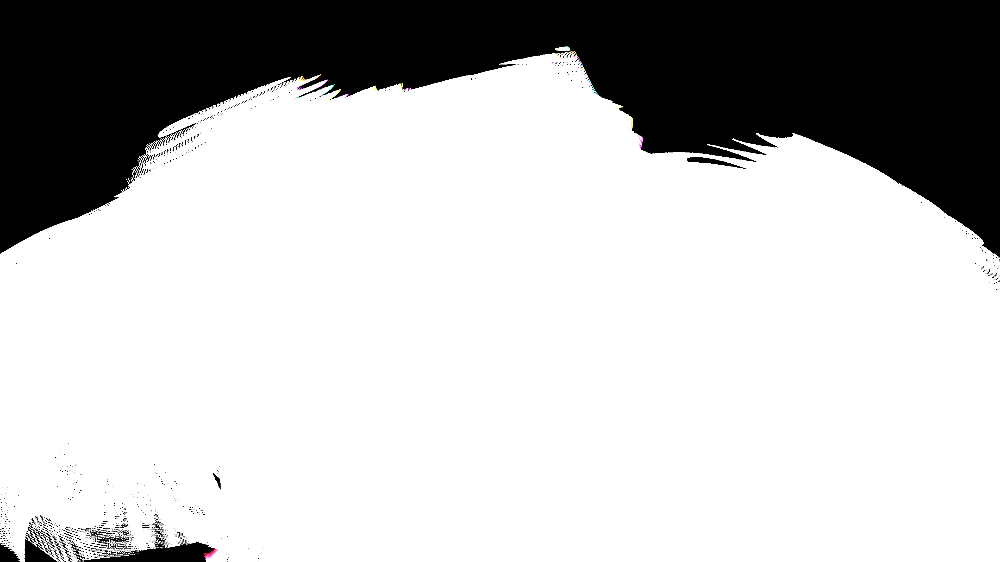

# generative_topographic_reaction_diffusion

## Metadata
- **Date**: 2026-05-24
- **Theme**: - **Format**: Animation (15s @ 60fps) - **Theme**: A high-tech digital contour map of an evolving, l
- **Technique**: Unknown
- **Logic Lab Reference**: 

## Concept
- **Format**: Animation (15s @ 60fps)
- **Theme**: A high-tech digital contour map of an evolving, living alien landscape.
- **Technique**: Instead of slow iterative simulation, this sketch evaluates a massive, complex mathematical interference pattern in real-time using NumPy vectorization. Five intersecting sine-wave fields, modulated by spatial distortions and rotating phase shifts, produce an incredibly organic scalar field. The script mathematically extracts the isobars (contour lines) of this field, rendering them as thousands of 3D points. The resulting animation looks like a topological map of a breathing, dividing biological organism, viewed through an orbiting camera.

## Technical Details
- **Renderer**: Unknown
- **Simulation**: Unknown
- **Visuals**: Unknown
- **Animation**: Contains animation details
