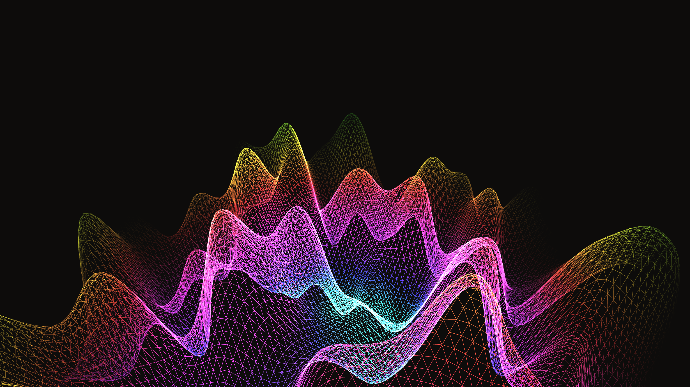

# generative_topological_mesh_distortion_3d

## Metadata
- **Date**: 2026-06-21
- **Theme**: An animated 15s sequence of a high-contrast, glowing 3D mesh that distorts continuously, creating mo
- **Technique**: Unknown
- **Logic Lab Reference**: 

## Concept
An animated 15s sequence of a high-contrast, glowing 3D mesh that distorts continuously, creating mountain-like peaks and valleys that roll across the surface like waves.

- **Theme**: A high-contrast, glowing 3D mesh that distorts continuously, creating mountain-like peaks and valleys that roll across the surface like waves.
- **Technique**: Generates a grid of vertices in 3D. It uses 2D perlin noise mapped to the Z-axis, driven by time so the noise moves across the grid over time. Using `py5.TRIANGLE_STRIP`, it renders the surface as a wireframe.

## Technical Details
- **Renderer**: Unknown
- **Simulation**: Unknown
- **Visuals**: Unknown
- **Animation**: Unknown
