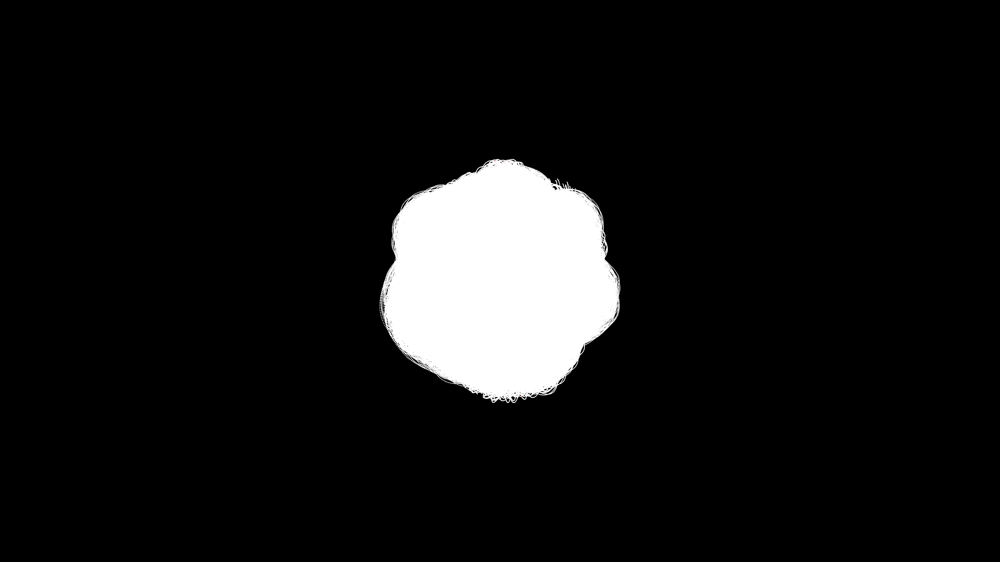

# generative_topological_torus_knot

## Metadata
- **Date**: 2026-05-24
- **Theme**: - **Format**: Animation (15s @ 60fps) - **Theme**: A glowing energetic torus knot that constantly tw
- **Technique**: Unknown
- **Logic Lab Reference**: 

## Concept
- **Format**: Animation (15s @ 60fps)
- **Theme**: A glowing energetic torus knot that constantly twists and folds itself through higher dimensions.
- **Technique**: A parameterized 3D torus knot ($p=3, q=7$) rendered using 20,000 instanced glowing points. An orthonormal basis is calculated across the entire complex mathematical curve to generate a dense, volumetric 3D tube. The points are displaced radially by a high-frequency traveling sine wave. Additive blending combined with a slow background fade leaves majestic, sweeping plasma trails as the camera orbits the knot.

## Technical Details
- **Renderer**: Unknown
- **Simulation**: Unknown
- **Visuals**: Unknown
- **Animation**: Contains animation details
