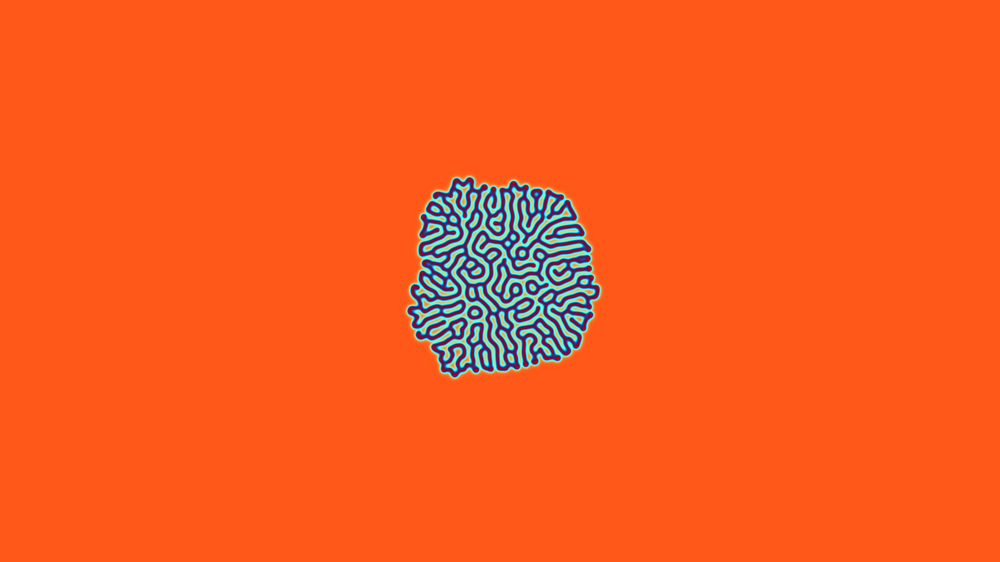

# generative_turing_pattern_reaction_diffusion_2d

## Metadata
- **Date**: 2026-06-28
- **Theme**: The Gray-Scott Reaction-Diffusion system
- **Technique**: Simulating this involves solving partial differential equations on a massive 2D grid. This sketch uses the highly optimized `scipy.ndimage.convolve` to apply a 3x3 Laplacian kernel across the array. The simulation runs 25 steps per frame, so the coral-like structures rapidly grow and expand organically from a few randomized seed points in the center.
- **Logic Lab Reference**: 

## Concept
The Gray-Scott Reaction-Diffusion system. This mathematical model simulates the interaction of two virtual chemicals ($U$ and $V$). $U$ is fed at a constant rate, while $V$ kills $U$ and decays over time. The interaction between these two simple rules produces astonishingly organic Turing patterns that look exactly like brain folds, coral reefs, or leopard spots as they grow outward.

## Technical Details
- **Renderer**: Unknown
- **Simulation**: Unknown
- **Visuals**: Unknown
- **Animation**: Contains animation details
