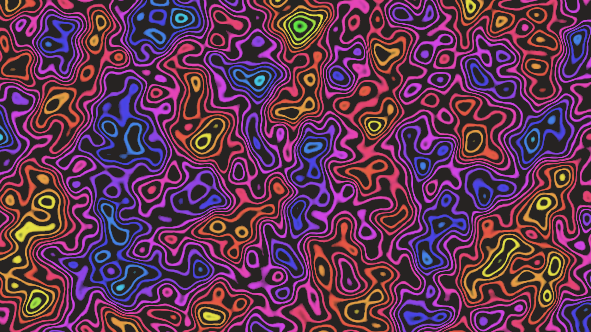

# generative_turing_pattern_topography_2d

## Metadata
- **Date**: 2026-06-21
- **Theme**: An animated 15s sequence of smooth, organic contours resembling Turing patterns, zebra stripes, or f
- **Technique**: Unknown
- **Logic Lab Reference**: 

## Concept
An animated 15s sequence of smooth, organic contours resembling Turing patterns, zebra stripes, or fingerprints that slowly drift and warp over time.

- **Theme**: Smooth, organic contours resembling Turing patterns, zebra stripes, or fingerprints that slowly drift and warp over time.
- **Technique**: Calculates `sin(noise(x,y,t) * scale)` to create contour lines. Uses the sine thresholding to draw thick organic lines, mimicking the appearance of reaction-diffusion or cellular automata on a 2D grid.

## Technical Details
- **Renderer**: Unknown
- **Simulation**: Unknown
- **Visuals**: Unknown
- **Animation**: Unknown
