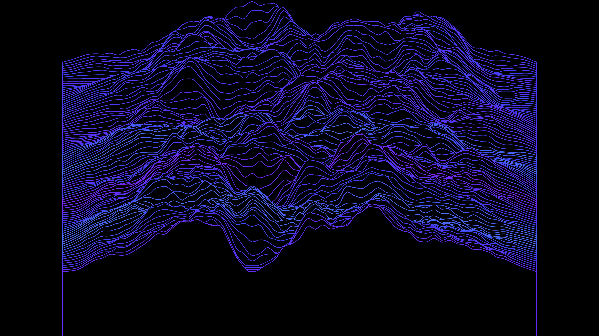

# generative_unknown_pleasures_landscape_2d

## Metadata
- **Date**: 2026-06-28
- **Theme**: A shifting, mountainous landscape made entirely of parallel horizontal lines, inspired by the iconic
- **Technique**: A grid of 100 horizontal lines is drawn sequentially from back to front. Vertices are displaced upwards on the Y-axis based on 3D Perlin noise, with a parabolic falloff applied to keep the edges flat and concentrate the "mountain" in the center. To simulate 3D occlusion in a pure 2D space, the lines are drawn as closed polygons filled with solid black, which obscures the lines behind them. By shifting the noise coordinates on the Y-axis over time, the landscape appears to move continuously towards the viewer.
- **Logic Lab Reference**: 

## Concept
A shifting, mountainous landscape made entirely of parallel horizontal lines, inspired by the iconic Joy Division "Unknown Pleasures" album cover (originally visualizing pulsar radio emissions). The terrain continuously flows forward, rendering 3D Perlin noise as dynamic, glowing data plots.

## Technical Details
- **Renderer**: Unknown
- **Simulation**: Unknown
- **Visuals**: Unknown
- **Animation**: Contains animation details
