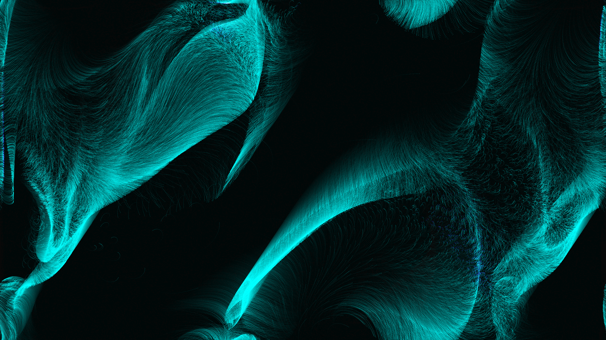

# generative_vector_field_flow_2d

## Metadata
- **Date**: 2026-06-28
- **Theme**: A massive, chaotic flow field simulation where 100,000 glowing particles are swept through a complex
- **Technique**: Tracking the velocity and position of 100,000 particles simultaneously using NumPy arrays. At each frame, the particles' velocities are updated by integrating an angular force derived from intersecting spatial sine waves. By segregating the points into speed buckets (slow vs. fast), we natively color-map them to deep purples and bright neon cyan using `py5.vertices()` for ultimate high-density rendering performance. Additive blending creates intense glowing trails.
- **Logic Lab Reference**: 

## Concept
A massive, chaotic flow field simulation where 100,000 glowing particles are swept through a complex, time-varying vector field, leaving fading neon trails that weave intricate tapestries of light.

## Technical Details
- **Renderer**: Unknown
- **Simulation**: Unknown
- **Visuals**: Unknown
- **Animation**: Contains animation details
