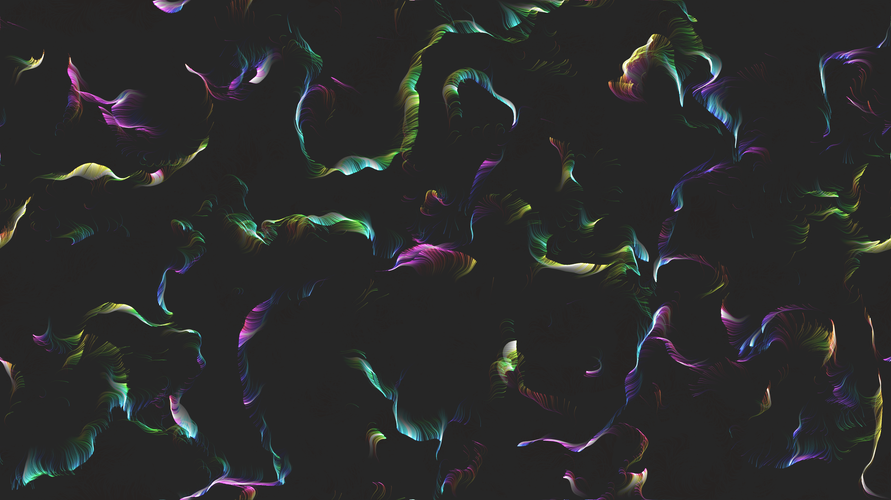

# generative_vector_field_flow_particles_2d

## Metadata
- **Date**: 2026-06-18
- **Theme**: A mesmerizing 2D animation of thousands of particles flowing gracefully through a dynamic vector fie
- **Technique**: Using 40,000 particles mapped to a 3D Perlin noise vector field (`py5.noise()`). The field angles evolve slowly over time, pushing the particles in swirling motions. The particles leave a soft translucent trail by drawing the background with a low alpha, creating a continuous generative painting effect.
- **Logic Lab Reference**: 

## Concept
A mesmerizing 2D animation of thousands of particles flowing gracefully through a dynamic vector field, creating intricate, organic hair-like patterns that slowly rotate and change color.

## Technical Details
- **Renderer**: Unknown
- **Simulation**: Unknown
- **Visuals**: Unknown
- **Animation**: Unknown
