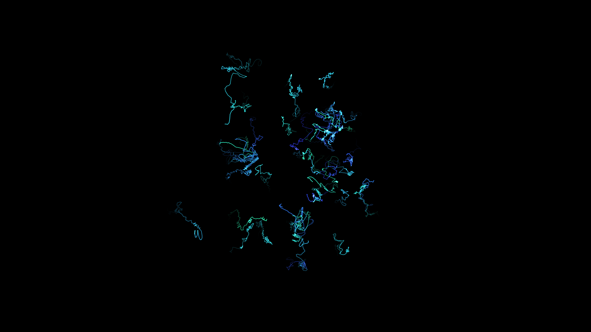

# generative_vector_field_ribbons_3d

## Metadata
- **Date**: 2026-06-20
- **Theme**: Smooth ribbons flowing through a 3D vector field, creating a silk-like appearance
- **Technique**: Unknown
- **Logic Lab Reference**: 

## Concept
Smooth ribbons flowing through a 3D vector field, creating a silk-like appearance.

## Technical Details
- **Renderer**: Unknown
- **Simulation**: Unknown
- **Visuals**: Unknown
- **Animation**: Contains animation details
