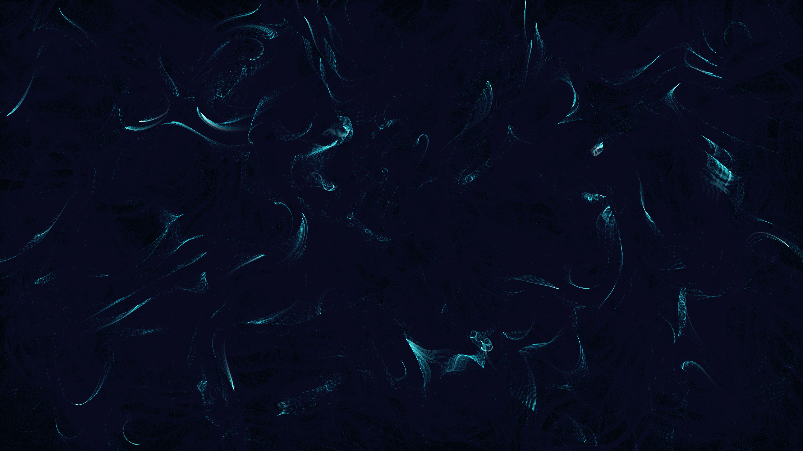

# generative_vector_flow_field_topography_2d

## Metadata
- **Date**: 2026-06-20
- **Theme**: A dense 2D vector flow field that draws topography lines instead of moving particles
- **Technique**: A grid of small line segments. The angle of each segment is determined by `py5.os_noise(x, y, z)`. The z parameter increments over time, smoothly evolving the field. The length and color of each segment are mapped to the noise value, creating waves of vibrant colors sweeping across a dark canvas.
- **Logic Lab Reference**: 

## Concept
A dense 2D vector flow field that draws topography lines instead of moving particles. The lines are drawn statically, but the underlying noise field slowly rotates and shifts its Z-offset over time, causing the drawn lines to writhe and form shifting terrain-like patterns.

## Technical Details
- **Renderer**: Unknown
- **Simulation**: Unknown
- **Visuals**: Unknown
- **Animation**: Contains animation details
