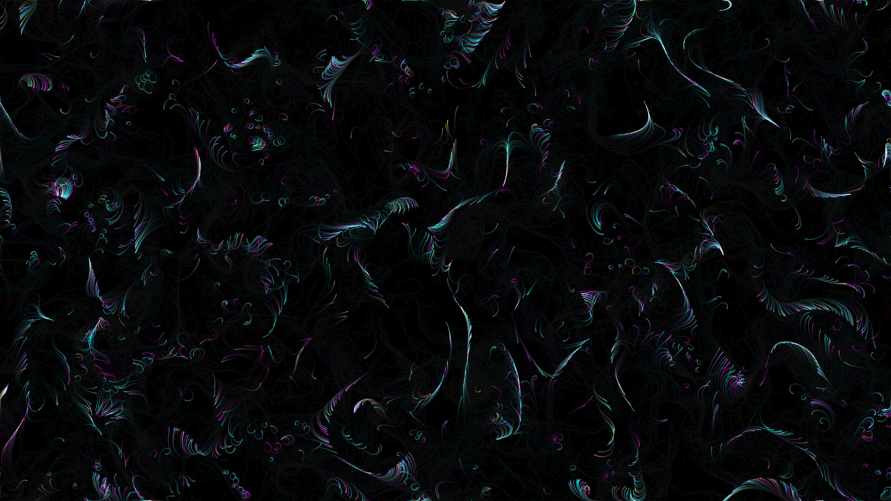

# generative_vector_flow_topography_2d

## Metadata
- **Date**: 2026-06-27
- **Theme**: An animated sequence of generative vector flow topography in 2D
- **Technique**: Unknown
- **Logic Lab Reference**: 

## Concept
An animated sequence of generative vector flow topography in 2D.

- **Theme**: A mesmerizingly intricate topographic map that constantly redraws and evolves itself over time.
- **Technique**: A 2D particle system where particles follow an OpenSimplex noise flow field, leaving trails with additive blending. The background is partially cleared each frame to create motion blur.
- **Format**: Animation (15s @ 60fps)

## Technical Details
- **Renderer**: Unknown
- **Simulation**: Unknown
- **Visuals**: Unknown
- **Animation**: Contains animation details
