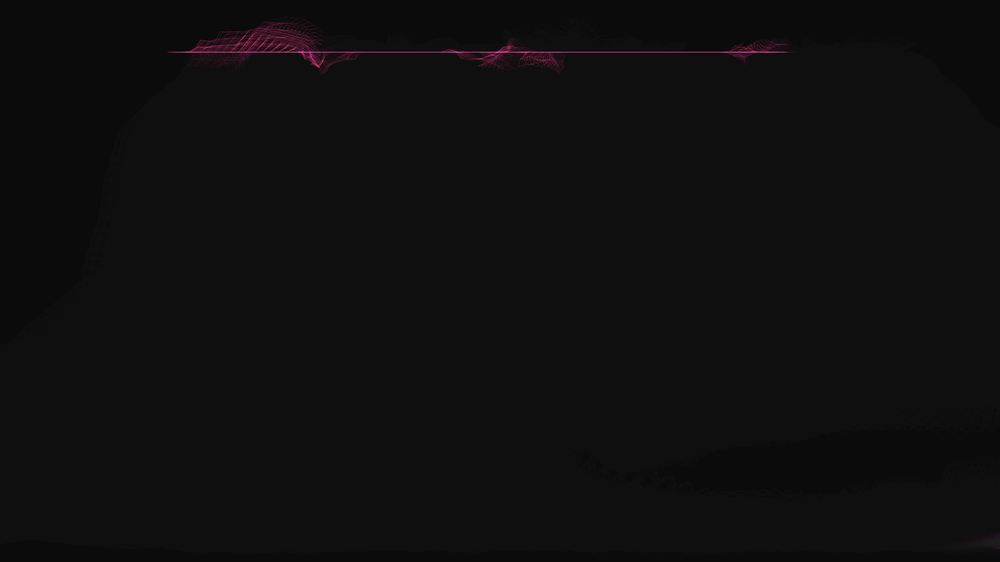

# generative_verlet_cloth_tearing_2d

## Metadata
- **Date**: 2026-06-26
- **Theme**: An animated 15s sequence of a glowing neon cybernetic net that is dragged through a turbulent wind
- **Technique**: Unknown
- **Logic Lab Reference**: 

## Concept
An animated 15s sequence of a glowing neon cybernetic net that is dragged through a turbulent wind. Under intense pressure, the links of the net stretch and snap, flailing wildly as the structure violently tears apart.

- **Theme**: A glowing neon cybernetic net that is dragged through a turbulent wind. Under intense pressure, the links of the net stretch and snap, flailing wildly as the structure violently tears apart.
- **Technique**: A 2D Verlet physics engine with thousands of points and springs. An OpenSimplex noise field applies varying wind forces to the points. When a spring's length exceeds its physical limit, it breaks. It is rendered with additive blending and motion blur.

## Technical Details
- **Renderer**: Unknown
- **Simulation**: Unknown
- **Visuals**: Unknown
- **Animation**: Unknown
