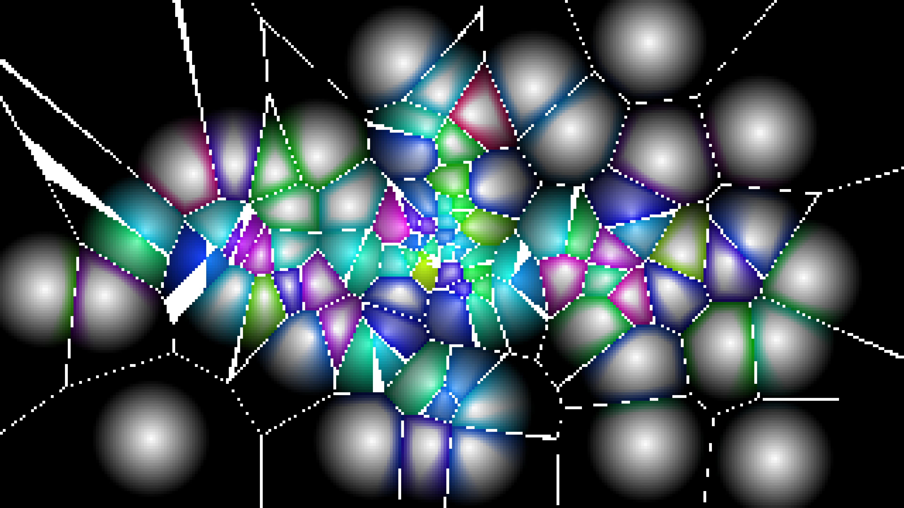

# generative_voronoi_reaction_diffusion_2d

## Metadata
- **Date**: 2026-06-20
- **Theme**: Simulating cellular division and chemical reaction-diffusion inside a moving Voronoi diagram
- **Technique**: A custom Voronoi algorithm runs on a down-sampled grid to calculate the closest and second-closest points from a set of 100 moving nodes. The distance between the closest and second-closest node is used to draw crisp white cell borders. The cell interiors are colored using 3D noise mapped to the cell's centroid, creating a continuous reaction-diffusion style gradient across the dynamic cellular matrix.
- **Logic Lab Reference**: 

## Concept
Simulating cellular division and chemical reaction-diffusion inside a moving Voronoi diagram.

## Technical Details
- **Renderer**: Unknown
- **Simulation**: Unknown
- **Visuals**: Unknown
- **Animation**: Contains animation details
