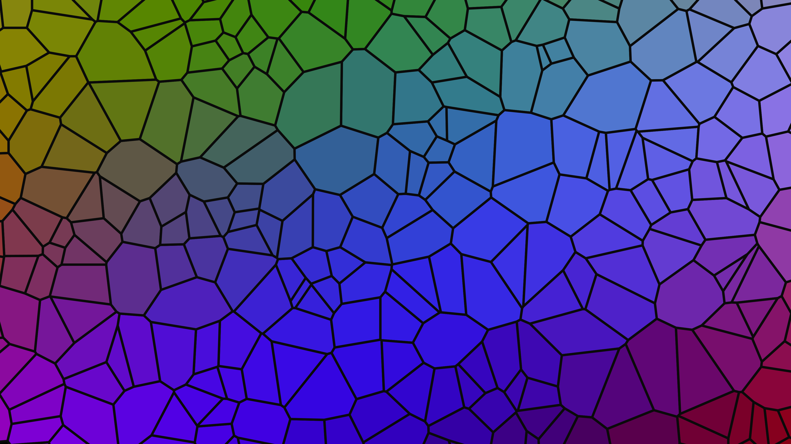

# generative_voronoi_stained_glass_2d

## Metadata
- **Date**: 2026-06-28
- **Theme**: A stained glass window made of flowing, morphing mathematical cells
- **Technique**: Using `scipy.spatial.Voronoi` to dynamically re-calculate polygon tessellations around 300 floating centroid points at 30fps. The polygon vertices are fed into py5 to draw thick, dark "lead" outlines, while the fills are shaded dynamically based on a spatial sine-wave color function.
- **Logic Lab Reference**: 

## Concept
A stained glass window made of flowing, morphing mathematical cells. The cells pulse and shift continuously with deep, vibrant cathedral colors.

## Technical Details
- **Renderer**: Unknown
- **Simulation**: Unknown
- **Visuals**: Unknown
- **Animation**: Contains animation details
