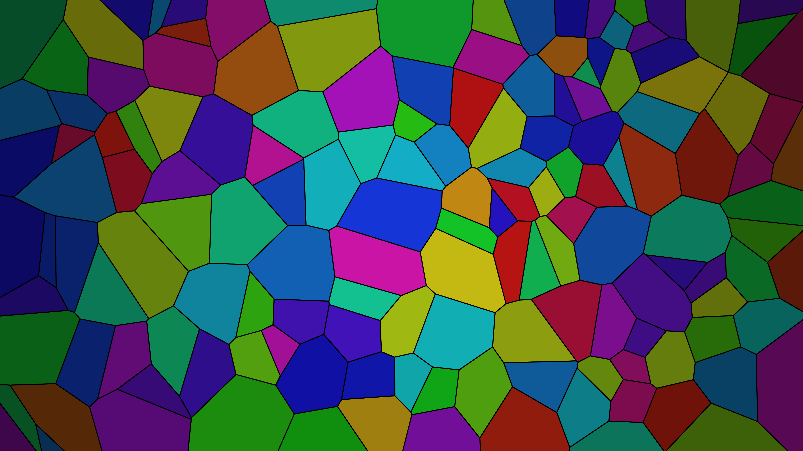

# generative_voronoi_stained_glass_fracture_2d

## Metadata
- **Date**: 2026-06-17
- **Theme**: A 2D animation of a stained glass window that continuously fractures and morphs into new Voronoi cel
- **Technique**: Used `scipy.spatial.Voronoi` to calculate cellular regions for seeds that drift using 2D Perlin noise. Cells are rendered with thick black borders, mimicking stained glass lead, and the inner hues shift over time with a dark vignette applied towards the edges.
- **Logic Lab Reference**: 

## Concept
A 2D animation of a stained glass window that continuously fractures and morphs into new Voronoi cell shapes, illuminated by slowly shifting light colors.

## Technical Details
- **Renderer**: Unknown
- **Simulation**: Unknown
- **Visuals**: Unknown
- **Animation**: Unknown
