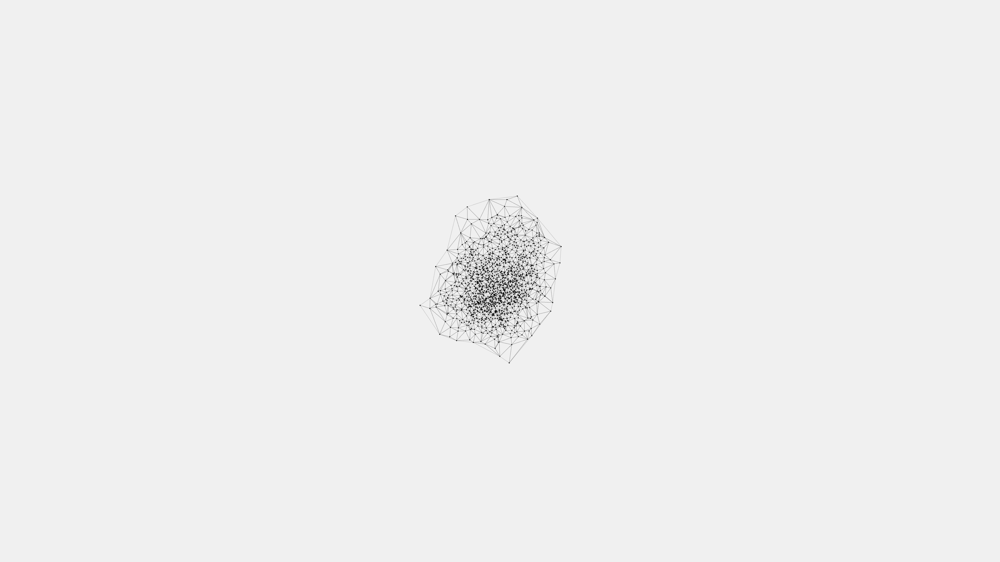

# generative_voronoi_stippling_growth_2d

## Metadata
- **Date**: 2026-06-20
- **Theme**: A mathematical stippling growth pattern based on an evolving Delaunay triangulation
- **Technique**: An animated sequence that starts with a few seed points and organically spawns new points over time in the largest empty circles, giving a cellular or bacterial growth appearance. Rendered purely as points and connecting lines (Delaunay triangulation) in monochrome.
- **Logic Lab Reference**: 

## Concept
A mathematical stippling growth pattern based on an evolving Delaunay triangulation.

## Technical Details
- **Renderer**: Unknown
- **Simulation**: Unknown
- **Visuals**: Unknown
- **Animation**: Contains animation details
