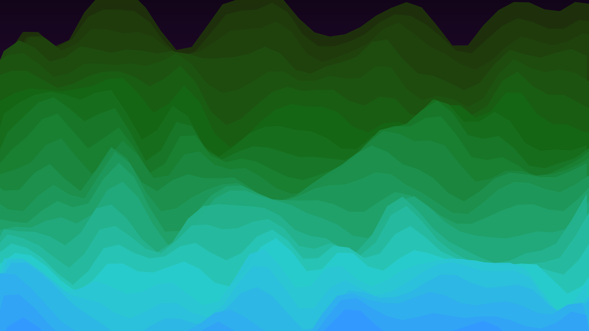

# generative_wavy_sine_landscapes_2d

## Metadata
- **Date**: 2026-06-27
- **Theme**: Generative Art
- **Technique**: Renders 25 layered polygon shapes drawn back-to-front. The vertices of each layer are modulated by a combination of OpenSimplex noise and sine waves, creating organic, rolling terrain. A parallax scrolling effect is achieved by increasing the horizontal offset speed for layers closer to the foreground. Colors are algorithmically shifted based on time and depth, creating a dynamic, atmospheric haze.
- **Logic Lab Reference**: 

## Concept
No concept description provided.

## Technical Details
- **Renderer**: Unknown
- **Simulation**: Unknown
- **Visuals**: Unknown
- **Animation**: Unknown
