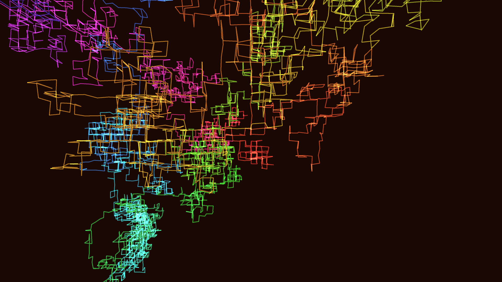

# geometric_fractal_hilbert_curve_3d

A visualization of a massive 3D fractal space-filling curve. A 3D lattice random walk expands outward from the center, mathematically transforming from a dense central cluster into an incredibly intricate cube of glowing circuitry. As time progresses, the vertices split and shift outward, creating a mesmerizing, folding optical illusion of infinite complexity. Rendered in P3D using a continuous additive-blended line strip.
