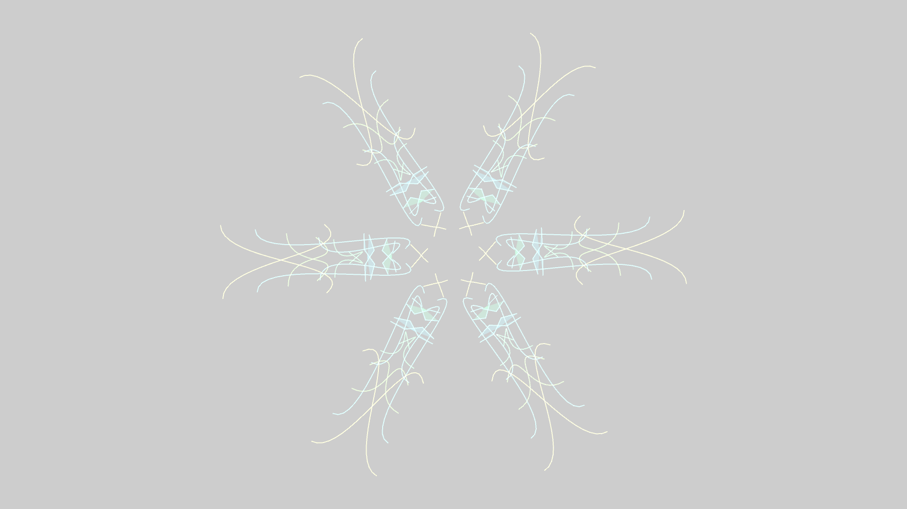

# geometric_fractal_kaleidoscope_mirrors

## Metadata
- **Date**: 2026-05-24
- **Theme**: A hypnotic simulation of a 12-axis kaleidoscope, folding dynamic bezier curves and polygons into per
- **Technique**: Unknown
- **Logic Lab Reference**: 

## Concept
A hypnotic simulation of a 12-axis kaleidoscope, folding dynamic bezier curves and polygons into perfect symmetry.

- **Date**: 2026-05-23
- **Theme**: Kaleidoscopes, reflection, fractals, sacred geometry, mirrors, symmetry, optical illusions.
- **Technique**: Uses matrix transformations (`py5.push_matrix()`, `py5.rotate()`) combined with matrix scaling (`py5.scale(1, -1)`) to perfectly mirror a single wedge of geometry 12 times in a circle. Inside the base wedge (slice), the script generates chaotic, overlapping Bezier curves and jagged polygons driven by time and Perlin noise. When this single slice is mirrored and repeated, the chaotic lines seamlessly connect across the boundaries of the slices, creating massive, perfectly symmetrical geometric mandalas. Additive blending (`py5.ADD`) and a slight motion blur trail make the shifting shapes glow like stained glass or a laser light show. 15s 60fps MP4.
- **Description**: A digital kaleidoscope turns endlessly, reflecting beams of neon light into a perfect 12-pointed star. As the internal "mirrors" shift, chaotic ribbons of cyan and magenta fold into intricate, symmetrical mandalas, expanding and collapsing like a breathing cosmic flower. The shapes flow seamlessly across the reflection boundaries, creating the hypnotic illusion of an infinitely repeating fractal universe.

## Technical Details
- **Renderer**: Unknown
- **Simulation**: Unknown
- **Visuals**: Unknown
- **Animation**: Contains animation details
