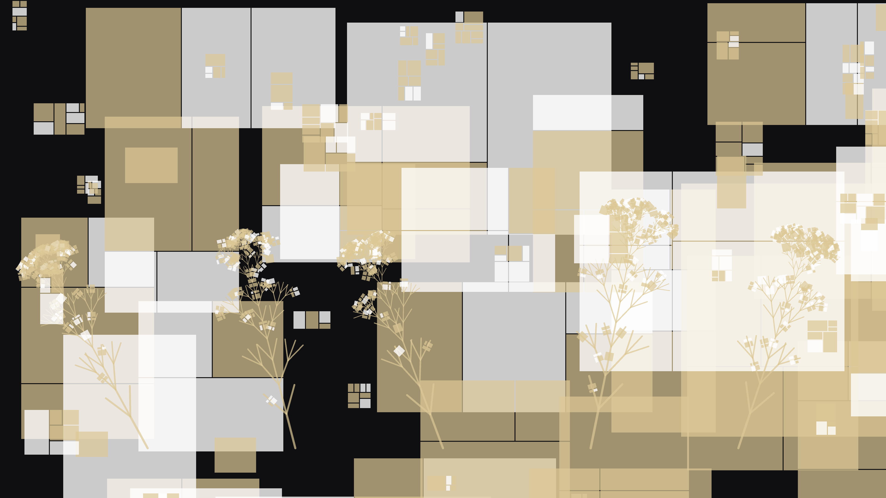

# geometric_growth

## Metadata
- **Date**: 2026-05-02
- **Theme**: mathematics, recursion, L-systems, architecture.
- **Technique**: L-system branching, recursive geometric subdivision, multi-layered depth, architectural rendering.
- **Logic Lab Reference**: None

## Concept
A dense, golden architectural forest growing across an obsidian void, where fractal L-system branches transition into intricate, Mondrian-style subdivision tiles.

## Technical Details
- **Renderer**: P2D
- **Simulation**: recursive, L-system.
- **Visuals**: layered py5 drawing.
- **Animation**: Animation
