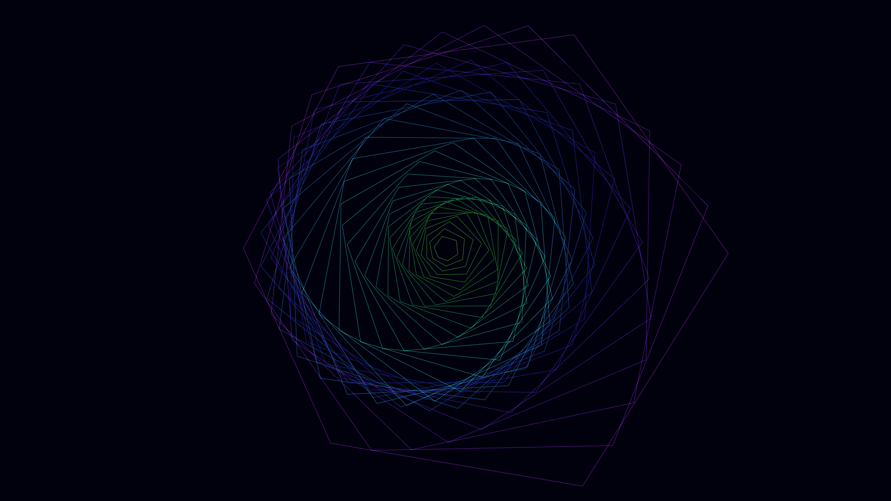

# geometric_interference_bloom_3d

## Metadata
- **Date**: 2026-05-25
- **Theme**: **Date**: 2026-05-25 **Theme**: A microscopic view of an artificial geometric bloom
- **Technique**: Unknown
- **Logic Lab Reference**: 

## Concept
**Date**: 2026-05-25
**Theme**: A microscopic view of an artificial geometric bloom.
**Technique**: Concentric 3D polygons scaling and rotating via a 2D interference ripple, rendered with additive blending.

## Technical Details
- **Renderer**: Unknown
- **Simulation**: Unknown
- **Visuals**: Unknown
- **Animation**: Preview image: `geometric_interference_bloom_3d_p1.png` Video: `geometric_interference_bloom_3d.mp4` (not tracked in git)
