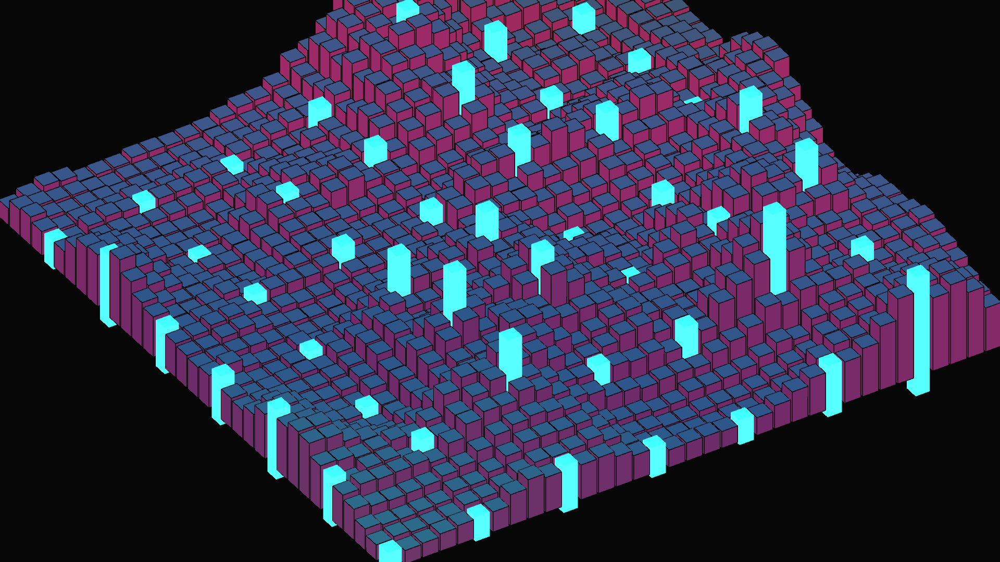

# geometric_isometric_cyber_city

## Metadata
- **Date**: 2026-05-24
- **Theme**: A procedurally generated brutalist cyber-city rendered in pure isometric projection
- **Technique**: Unknown
- **Logic Lab Reference**: 

## Concept
A procedurally generated brutalist cyber-city rendered in pure isometric projection.

- **Date**: 2026-05-23
- **Theme**: Cyberpunk, isometric projection, brutalist architecture, procedural generation, living cities.
- **Technique**: A massive 35x35 grid of 3D boxes is generated using `py5.box()`. The camera is strictly set to an orthographic projection (`py5.ortho()`) and rotated to precise isometric angles ($\arcsin(1/\sqrt{3})$ and $45^\circ$). The height of each "building" is dynamically driven by an exponentiated 3D Perlin noise field moving over time, creating sharp, towering skyscrapers and deep valleys that ripple like a fluid wave. Multi-colored directional lighting casts dramatic shadows, while select buildings are rendered as pure, glowing emissive neon pillars. 15s 60fps MP4.
- **Description**: An endless, futuristic metropolis viewed from a classic video-game isometric perspective. The brutalist concrete skyscrapers stretch and shrink continuously, as if the entire city is a living, breathing organism reacting to a digital earthquake. Saturated neon cyan and magenta lights sweep across the angular architecture, while hyper-tall glowing monolithic towers pierce the skyline like beacons in the geometric night.

## Technical Details
- **Renderer**: Unknown
- **Simulation**: Unknown
- **Visuals**: Unknown
- **Animation**: Contains animation details
