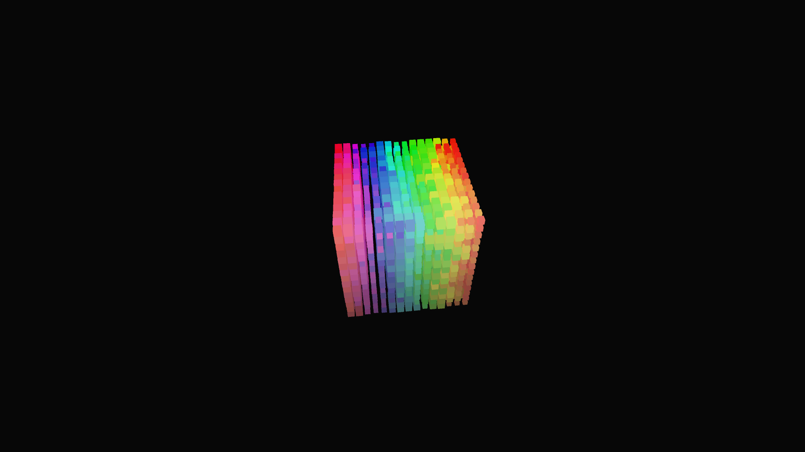

# geometric_isometric_voxel_sorting

## Metadata
- **Date**: 2026-05-24
- **Theme**: A 3D visualization of algorithmic self-organization using a modified Bubble Sort algorithm on a volu
- **Technique**: Unknown
- **Logic Lab Reference**: 

## Concept
A 3D visualization of algorithmic self-organization using a modified Bubble Sort algorithm on a volumetric pixel (voxel) grid.

- **Date**: 2026-05-23
- **Theme**: Pixel sorting, algorithms, voxels, entropy to order, 3D data visualization, isometric projection.
- **Technique**: Starts with a $15 \times 15 \times 15$ grid (3,375 voxels) of completely randomized colors (Hue, Saturation, Brightness). Every frame, the script runs partial passes of a Bubble Sort algorithm along the X, Y, and Z axes. The X-axis sorts by Hue, the Y-axis sorts by Saturation, and the Z-axis sorts by Brightness. As the algorithm progresses over 15 seconds, the chaotic block of noise magically self-organizes into a perfect, smooth 3D RGB color gradient cube. The voxels also "breathe" (scale up and down) based on their hue, meaning as the cube sorts itself, the random glitchy scaling organizes into a smooth geometric wave. Rendered in `py5.P3D` with an isometric camera angle. 15s 60fps MP4.
- **Description**: Entropy reversing into perfect order. A massive, rotating cubic structure is made of thousands of tiny, randomly colored floating blocks. Over time, the blocks begin to shift and swap places autonomously. Slowly, a pattern emerges from the chaos. The random noise reorganizes itself until it forms a flawless, glowing 3D rainbow gradient cube, undulating smoothly as its internal colors harmonize.

## Technical Details
- **Renderer**: P3D
- **Simulation**: Unknown
- **Visuals**: Unknown
- **Animation**: Contains animation details
