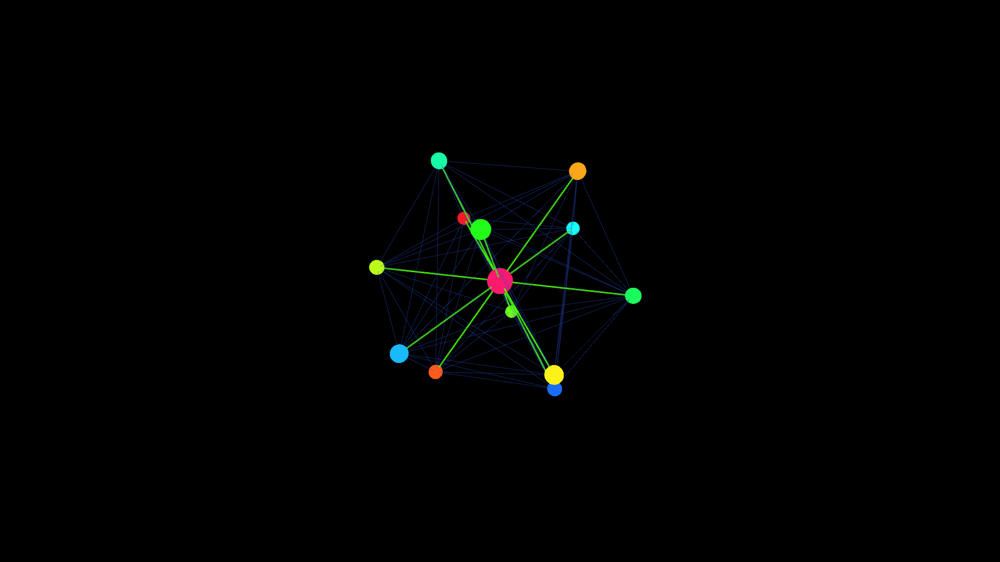

# geometric_metatron_cube_3d

## Metadata
- **Date**: 2026-05-23
- **Theme**: A sacred geometry visualization extending Metatron's Cube into fully rotating 3D space
- **Technique**: Unknown
- **Logic Lab Reference**: 

## Concept
A sacred geometry visualization extending Metatron's Cube into fully rotating 3D space.

- **Date**: 2026-05-23
- **Theme**: Sacred geometry, Metatron's Cube, Vector Equilibrium, esoteric math.
- **Technique**: Constructs the 13 foundational spheres of Metatron's Cube in 3D using the vertices of a cuboctahedron (Vector Equilibrium) plus a central node. All 78 possible connecting lines between these 13 centers are drawn in P3D. The structure rotates smoothly on all three axes while the lines pulse with dynamic HSB neon colors. Lines connected to the center are rendered thicker and brighter, emphasizing the radial energy of the shape, while the vertices themselves are drawn as glowing 3D spheres. 15s 60fps MP4.
- **Description**: A mathematically perfect, glowing geometrical construct floats in the void. It consists of 13 brightly lit spheres connected by an intricate web of 78 intersecting neon lines. As the entire complex structure tumbles and rotates in 3D space, it occasionally aligns perfectly with the camera to reveal the classic 2D sacred geometry pattern of Metatron's Cube, before breaking apart again into complex 3D depth.

## Technical Details
- **Renderer**: P3D
- **Simulation**: Unknown
- **Visuals**: Unknown
- **Animation**: Contains animation details
