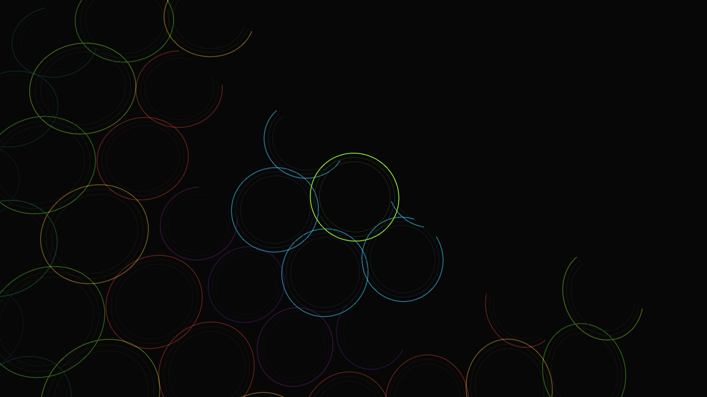

# geometric_sacred_flower_of_life

## Metadata
- **Date**: 2026-05-24
- **Theme**: A kinetic 3D visualization of the sacred geometry "Flower of Life" blooming dynamically
- **Technique**: Unknown
- **Logic Lab Reference**: 

## Concept
A kinetic 3D visualization of the sacred geometry "Flower of Life" blooming dynamically.

- **Date**: 2026-05-23
- **Theme**: Sacred geometry, Flower of Life, mandalas, blooming, interconnectedness, enlightenment.
- **Technique**: Uses a mathematical hexagonal lattice generator (Axial coordinates $q$ and $r$) to precisely calculate the intersecting center points for 91 overlapping circles. Instead of drawing it flat, the script adds a Z-axis depth ripple driven by a sine wave (`py5.translate(x, y, py5.sin(phase) * 50)`). Additive blending (`py5.ADD`) is used to make the overlapping geometric intersections glow with intense neon light. The radius of the circles and the overall structure breathe and pulsate in an outward-radiating wave pattern, simulating the "blooming" of a cosmic flower. 15s 60fps MP4.
- **Description**: The ancient "Flower of Life" symbol comes alive as a glowing, three-dimensional digital mandala. Perfectly overlapping neon circles ripple and breathe outward from the center, creating hypnotic, shifting petal patterns where their geometries intersect. The overlapping rings glow white-hot at their junctions, shifting continuously through a brilliant spectrum of cyan, magenta, and gold as the entire cosmic lattice slowly rotates in the dark void.

## Technical Details
- **Renderer**: Unknown
- **Simulation**: Unknown
- **Visuals**: Unknown
- **Animation**: Contains animation details
