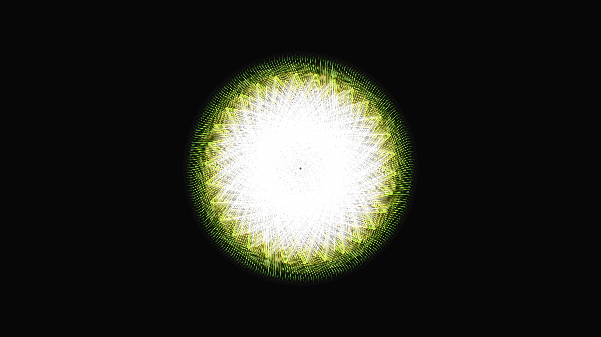

# geometric_sacred_mandala_kaleidoscope_2d

## Metadata
- **Date**: 2026-06-18
- **Theme**: A slowly blooming 2D sacred geometry mandala using kaleidocopic transformations
- **Technique**: Using `py5.push_matrix()`, `py5.rotate()`, and `py5.scale()` in a loop to draw symmetrical layers of geometric shapes (triangles, circles, lines). The shapes expand and contract using `sin()` waves over time. Colors cycle smoothly through the HSB spectrum.
- **Logic Lab Reference**: 

## Concept
A slowly blooming 2D sacred geometry mandala using kaleidocopic transformations.

## Technical Details
- **Renderer**: Unknown
- **Simulation**: Unknown
- **Visuals**: Unknown
- **Animation**: Unknown
