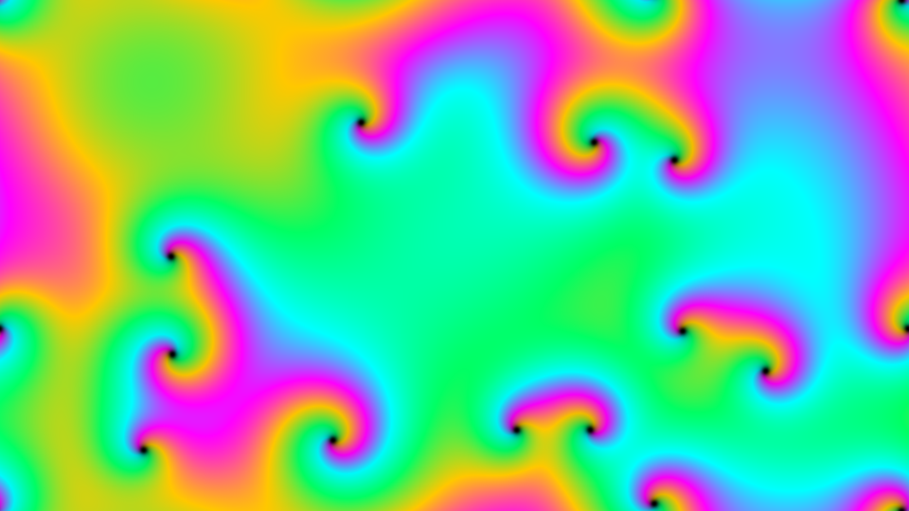

# ginzburg_landau_spiral_defects

## Metadata
- **Date**: 2026-05-22
- **Theme**: The mesmerizing, spontaneous emergence of rotating spiral waves and topological defects in a complex
- **Technique**: Unknown
- **Logic Lab Reference**: 

## Concept
The mesmerizing, spontaneous emergence of rotating spiral waves and topological defects in a complex oscillatory medium, modeling phenomena ranging from chemical clocks (like the Belousov-Zhabotinsky reaction) to quantum superconductivity.

## Technical Details
- **Renderer**: Unknown
- **Simulation**: Unknown
- **Visuals**: Unknown
- **Animation**: Contains animation details
