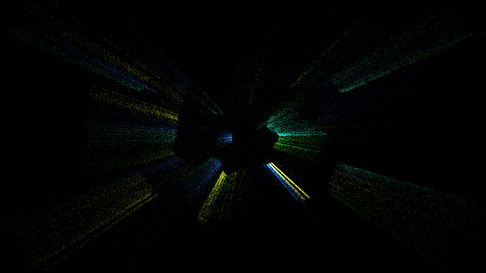

# ginzburg_landau_vortices

## Metadata
- **Date**: 2026-05-09
- **Theme**: Ginzburg-Landau theory, topological defects, vortex-antivortex turbulence, superconductivity.
- **Technique**: Time-Dependent Ginzburg-Landau (TDGL) simulation on a 128x128 complex scalar field. Visualizes the phase transition and topological defect dynamics using 40,000 advected particles. Features multi-pass additive rendering with a "Superconducting Gold / Electric Blue" palette. 60fps high-bitrate MP4.
- **Logic Lab Reference**: None

## Concept
A stunning visualization of a superconducting phase transition; complex filaments of molten gold and electric blue energy swirl and dance as topological vortices collide and annihilate in a shimmering obsidian void.

## Technical Details
- **Renderer**: P2D
- **Simulation**: particle.
- **Visuals**: additive blending, dark-field contrast.
- **Animation**: 10 seconds at 60fps
