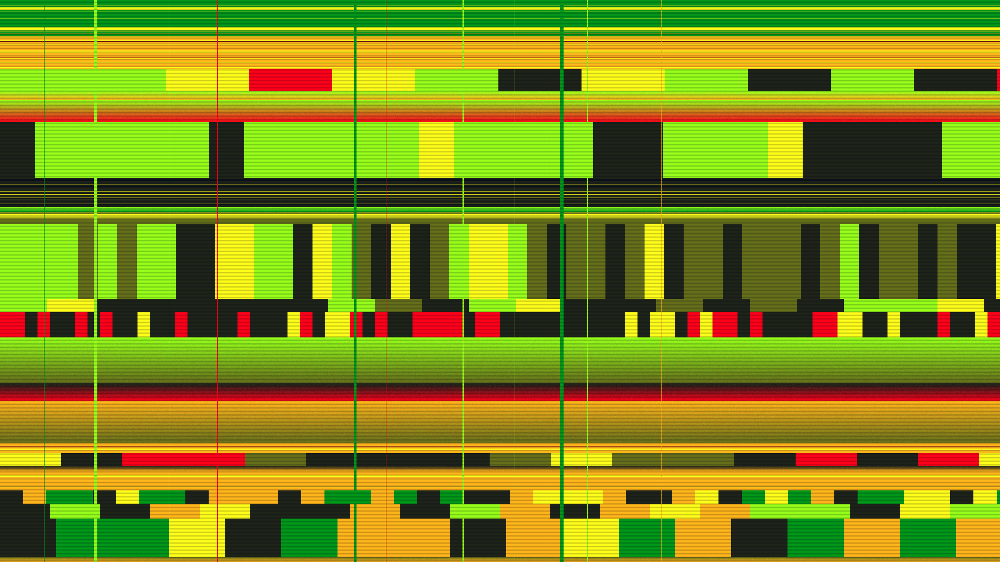

# glitch_strata

## Metadata
- **Date**: 2026-05-02
- **Theme**: digital decay, data corruption, archaeology, glitch art.
- **Technique**: recursive stratification, horizontal displacement mapping, block corruption, scanline synthesis.
- **Logic Lab Reference**: None

## Concept
A vertical cross-section of corrupted digital memory, rendered as high-contrast neon strata with horizontal tearing and geometric data blocks.

## Technical Details
- **Renderer**: P2D
- **Simulation**: recursive.
- **Visuals**: bloom-like highlights, dark-field contrast.
- **Animation**: Animation
