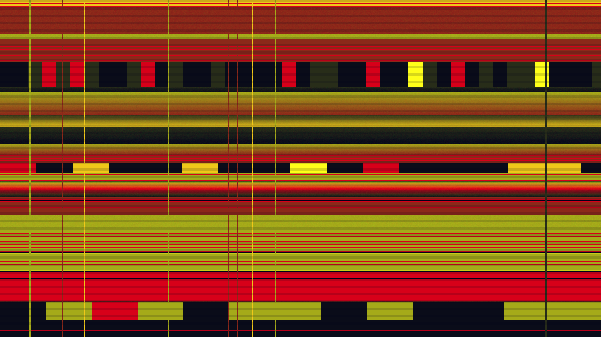

# glitch_strata_v2

## Metadata
- **Date**: 2026-05-10
- **Theme**: luxury decay, obsidian & gold, digital archaeology, high-fidelity corruption
- **Technique**: recursive stratification, horizontal displacement mapping, block corruption, scanline synthesis
- **Parent Work**: [glitch_strata](../glitch_strata/)

## Concept
A polished refinement of the `glitch_strata` concept, shifting from cyberpunk neons to a "luxury decay" aesthetic using an Obsidian & Gold palette. The visualization represents a high-value data stream undergoing elegant, structured corruption.

## Technical Details
- **Renderer**: P2D
- **Simulation**: recursive stratification
- **Visuals**: horizontal displacement mapping, block corruption, scanline synthesis, improved noise-to-signal ratio
- **Changes from v1**: Updated palette to Obsidian/Gold/Amber, fixed preview naming convention, adjusted noise parameters for cleaner stratification.
